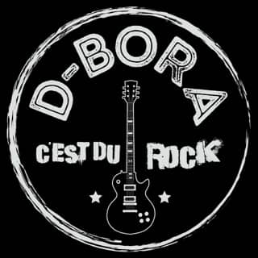

# Biographie

L’origine du groupe remonte à la rencontre en 2012 entre Fred, qui jouait encore de la basse à l’époque, et Jean-Pierre qui souhaitait reprendre la musique après l’achat d’une guitare acoustique.
S’en résulte une première compo : “Avoir 20 ans”.

Bien plus tard, en 2018, l’envie de monter une vraie formation rock se précise et Jean-Paul rejoint le groupe avec ses baguettes.

En 2019, une jeune bassiste débutante arrive : Déborah. Le groupe répète et commence à composer ses premiers morceaux. Après quelques mois, la galère : COVID19 arrive ! Tout est à l'arrêt, impossible de répéter…

Et en avril 2020, cette jeune femme pleine de vie, de bonne humeur nous quitte dans un tragique accident… comme un éclair dans leurs vies, comme un éclair tu es partie.

JP, Fred et Jean Paul sont à terre et ils se demandent quoi faire. Comment lui rendre hommage et la garder proche…
La musique doit continuer et ce groupe qui n'avait pas de nom et tout naturellement baptisé pour lui rendre hommage : D-BORA

Pour continuer il faut un nouveau membre pour prendre la suite de Déborah.
Une annonce de recrutement est publiée début mai 2020. Mathieu intègre le groupe en mai 2020 à la basse.

Une première prestation live Facebook pour la fête de la musique 2021. Puis participation au ROCK'N'Potes#5 au profit de clowns de l'espoir en septembre 2021 et au MAINSQU'ERRE en octobre 2021.

En Mars 2022, Jean-Paul décide d’explorer d’autres contrées musicales.
A 3 sans batteurs c'est compliqué pour le groupe de continuer à travailler, alors Mathieu, après 2 ans d'arrêt, reprend la batterie !

Après quelques mois à 3, il faut compléter le line up : il faut un bassiste.
Ce sera chose faite en juillet 2022 avec l'arrivée de Bob.

L'aventure continue…

